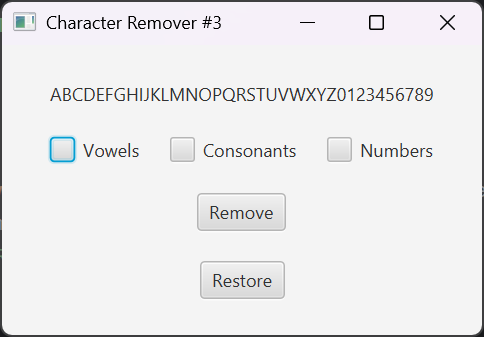
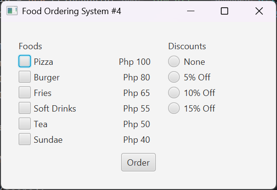
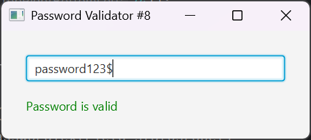

# JavaFX GUI

JavaFX GUI. Built using Java and OOPs.  
Built with **Overhead Only Programming** paradigm in mind.

**Author:** Glenshayne Belarmino (Jolo's Bizarre Adventure #4)– [@GlenshC](https://github.com/GlenshC)

## 📸 Preview

| Description             | Image                               |
|-------------------------|-------------------------------------|
| Character Remover #3    |     |
| Food Ordering System #4 |  |
| Pasword Validator #8    |    |